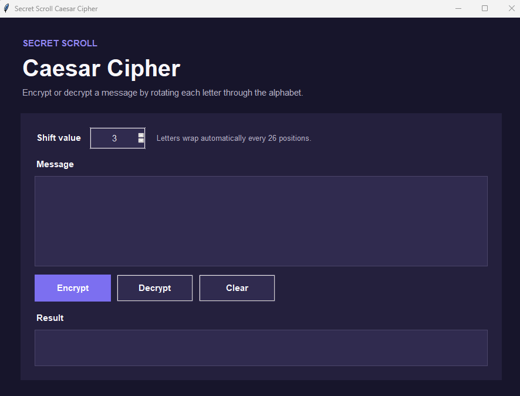

# 📜 Secret Scroll Caesar Cipher

> **Task 01:** A Python desktop application that encrypts and decrypts text using the classical Caesar cipher. Users provide a message and shift value, and the application rotates alphabetic characters while preserving capitalization, spaces, numbers, and punctuation.

<p align="left">
  
  
  
  
</p>

---

## 📌 Task Objective

Create a Python program that can encrypt and decrypt text using the Caesar cipher algorithm. The program accepts:

- A text message
- An integer shift value
- An encryption or decryption operation

## ✨ Features

- Encrypts and decrypts text with any positive or negative integer shift.
- Preserves uppercase and lowercase letters.
- Leaves spaces, punctuation, numbers, emoji, and non-English characters unchanged.
- Normalizes large shifts automatically using modulo 26.
- Validates the shift value and empty message input.
- Includes a clean Tkinter desktop interface.
- Provides clear, copy, and keyboard-shortcut controls.
- Uses only the Python standard library.

## 📸 Screenshots

Replace the holders below with screenshots saved in the `screenshots/` folder.

| Main interface | Encryption result | Decryption result |
| --- | --- | --- |
| **Screenshot holder**<br>`screenshots/main_interface.png` | **Screenshot holder**<br>`screenshots/encrypted_message.png` | **Screenshot holder**<br>`screenshots/decrypted_message.png` |

### Required Screenshot Names

1. `main_interface.png` — the application immediately after launch.
2. `encrypted_message.png` — a message encrypted with a visible shift value.
3. `decrypted_message.png` — the ciphertext restored to the original message.

After adding the images, replace each holder in the table with the corresponding Markdown image, for example:

```markdown

```

## 🧠 How the Caesar Cipher Works

The Caesar cipher replaces each letter with another letter a fixed number of positions away in the alphabet. With a shift of `3`:

```text
Plaintext:  Hello, World!
Ciphertext: Khoor, Zruog!
```

Decryption applies the shift in the opposite direction:

```text
Khoor, Zruog! → Hello, World!
```

The transformation for each alphabetic character is:

```text
Encrypted position = (original position + shift) mod 26
Decrypted position = (encrypted position - shift) mod 26
```

> The Caesar cipher is historically important but is not secure for protecting real confidential information.

## 🚀 Getting Started

### 1. Clone the repository

```bash
git clone https://github.com/AvatarParzival/Secret-Scroll-Caesar-Cipher.git
cd Secret-Scroll-Caesar-Cipher
```

### 2. Run the application

```bash
python secret_scroll.py
```

No third-party packages are required. Tkinter is included with standard Python installations on Windows and macOS. Some Linux distributions may require the system package `python3-tk`.

## 📦 Build a Windows Executable

Double-click `build_exe.bat`. The script will:

1. Confirm that Python and pip are available.
2. Install or update PyInstaller.
3. Build a single, windowed executable.

The completed application will be available at:

```text
dist\SecretScrollCaesarCipher.exe
```

You can also run the builder from Command Prompt:

```bat
build_exe.bat
```

> The batch file builds an `.exe`; it does not convert the Python application into a batch script.

## 🖥️ Usage

1. Enter an integer in the **Shift value** field.
2. Type or paste a message into the **Message** box.
3. Select **Encrypt** or **Decrypt**.
4. Review the transformed message in the **Result** box.
5. Select **Copy result** to copy it to the clipboard.
6. Select **Clear** to reset the interface.

Press `Ctrl+Enter` to encrypt the current message.

## 🧪 Examples

| Operation | Input | Shift | Output |
| --- | --- | ---: | --- |
| Encrypt | `Attack at dawn!` | 3 | `Dwwdfn dw gdzq!` |
| Decrypt | `Dwwdfn dw gdzq!` | 3 | `Attack at dawn!` |
| Encrypt | `Python 3.13` | 5 | `Udymts 3.13` |
| Encrypt | `xyz XYZ` | 3 | `abc ABC` |
| Encrypt | `Hello!` | -1 | `Gdkkn!` |

## 📁 Project Structure

```text
Secret-Scroll-Caesar-Cipher/
├── caesar_cipher.py
├── secret_scroll.py
├── test_secret_scroll.py
├── build_exe.bat
├── screenshots/
│   └── README.md
├── LICENSE
└── README.md
```

## ✅ Running the Tests

```bash
python -m unittest -v
```

The tests cover encryption, decryption, alphabet wrapping, capitalization, punctuation, negative shifts, large shifts, empty text, and round-trip recovery.

## ⚠️ Educational Use

This project demonstrates substitution ciphers and modular arithmetic. Caesar cipher encryption can be broken easily through brute force or frequency analysis and must not be used for passwords, financial records, private communications, or other sensitive data.

## 🧑‍💻 Author

Created and maintained by **Abdullah Zubair**.

- GitHub: [@AvatarParzival](https://github.com/AvatarParzival)
- LinkedIn: [Abdullah Zubair](https://www.linkedin.com/in/abdullahzubairr)
- Email: [abdullah69zubair@gmail.com](mailto:abdullah69zubair@gmail.com)

## 📄 License

Released under the [MIT License](LICENSE). You may use, modify, and distribute this project under the license terms.
